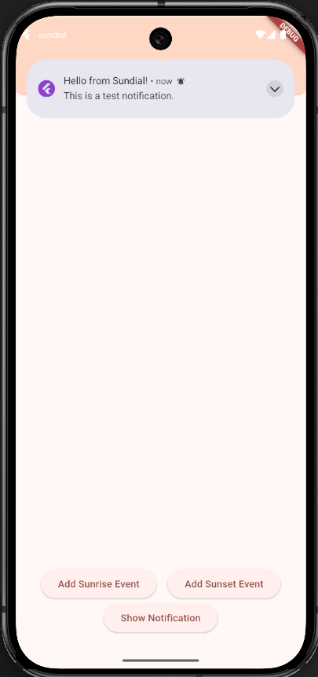
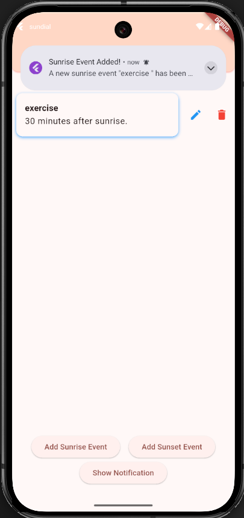
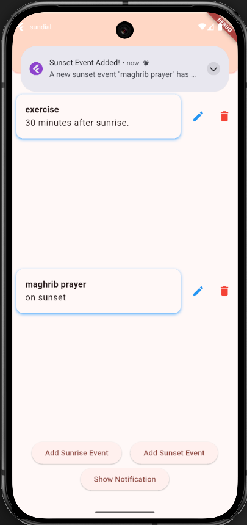
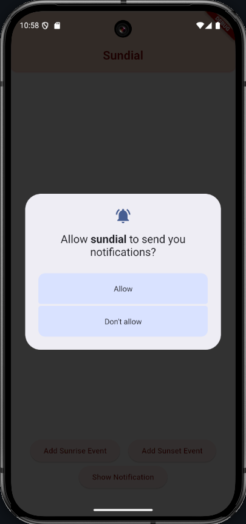

 

> ⚠️ ⚠️ **Notice for ITS Mobile Programming Graders**
> please make sure that you are referring to ***one of the branches below*** and their respective commits for grading, as the ***main branch includes latest commits*** to the app, ***including updates done after assignment deadline/s.***

- **Section 5, 25 Mar 2025:** `s05`
- **Section 11, 19 May 2025:** `s11`

# `sundial` - Notification Feature Branch
> *an intercogni app*

This branch focuses on the implementation of a robust notification system using the `awesome_notifications` package.

## 🌟 Notification Feature Overview 🚀

This feature integrates a comprehensive notification system into the Sundial app, providing timely alerts for various events.

### Key Implementations:
-   **`awesome_notifications` Package Integration:** The `awesome_notifications` package has been added as a dependency and initialized in the application's entry point (`lib/main.dart`).
-   **Android NDK and SDK Compatibility:** Resolved compatibility issues by updating `ndkVersion` and `minSdk` in `android/app/build.gradle.kts` to ensure proper functioning on Android devices.
-   **Runtime Permission Request:** The necessary `POST_NOTIFICATIONS` permission is requested at runtime, ensuring compliance with Android 13+ requirements.
-   **Test Notification Button:** A dedicated button on the main screen allows for quick testing of the notification system.
-   **Event-Triggered Notifications:** Notifications are automatically triggered when new Sunrise or Sunset events are successfully added, providing immediate feedback to the user.

### Visual Demonstrations:

	<h4 align="center">Test Notification</h4>
	<em align="center">Click the "Show Notification" button on the main screen to see a basic test notification.</em>    
	
	   
	<h4 align="center">Sunrise Event Added Notification</h4>
	<em align="center">Receive an instant notification when you successfully add a new Sunrise event.</em>    
	
	   
	<h4 align="center">Sunset Event Added Notification</h4>
	<em align="center">Receive an instant notification when you successfully add a new Sunset event.</em>    
	
	   
	<h4 align="center">Notification Alert Example</h4>
	<em align="center">An example of how a notification alert appears on your device.</em>    
	

