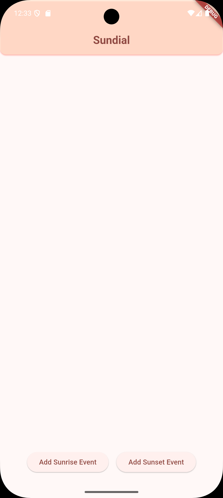
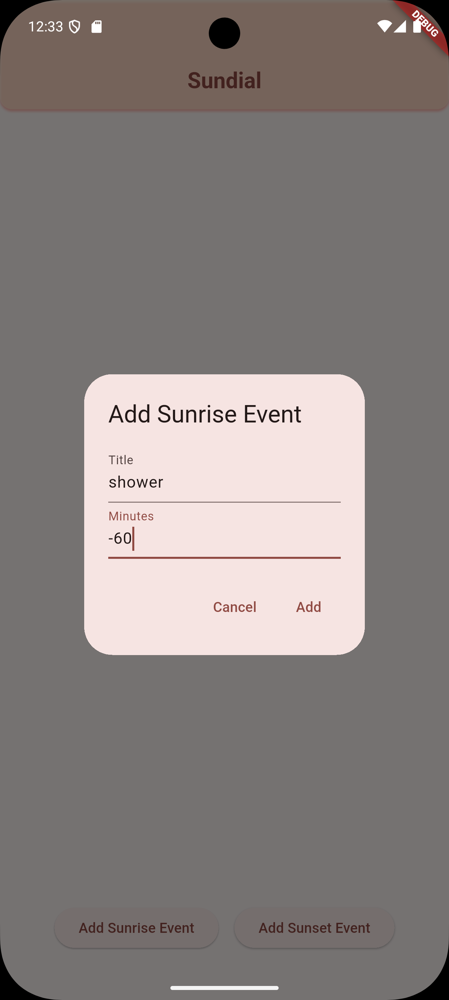
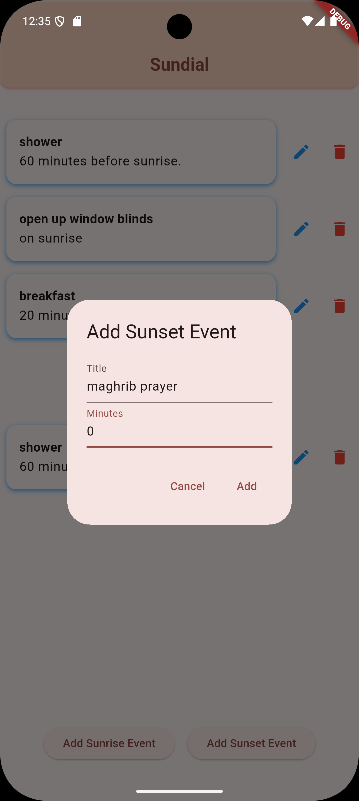
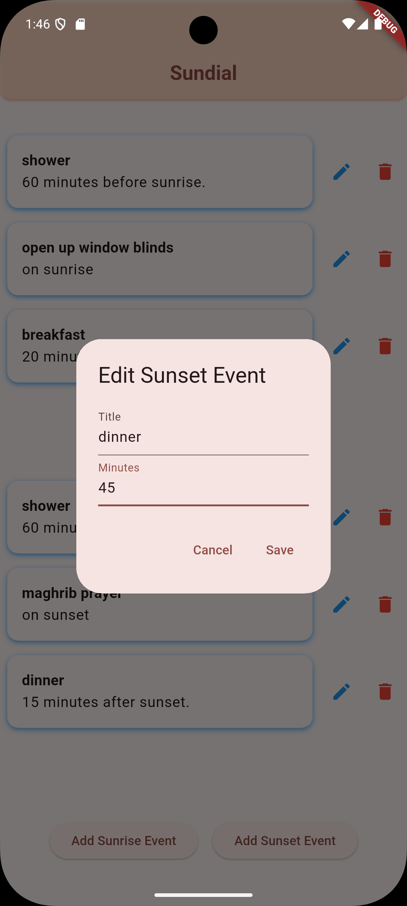
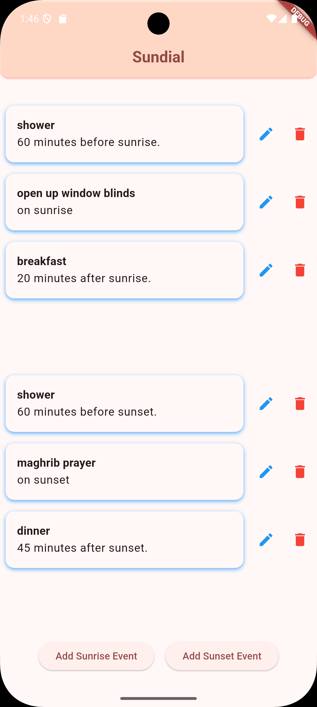
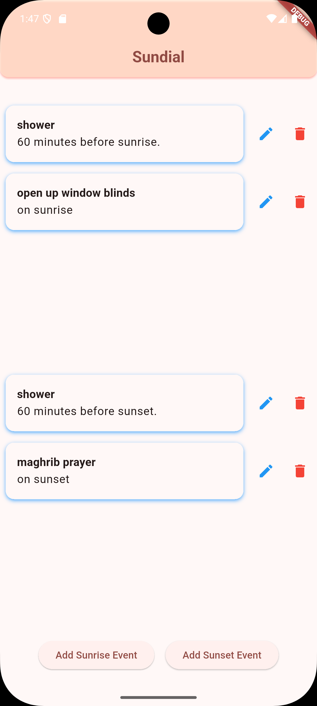

> ⚠️ ⚠️ ⚠️ **Notice for ITS EF4601 Mobile Programming Graders** ⚠️ ⚠️ ⚠️
> please make sure that you are referring to ***one of the branches below*** and their respective commits for grading, as the ***main branch includes latest commits*** to the app, ***including updates done after assignment deadline/s.***

- **Section 5, 25 Mar 2025:** `s05`

# `sundial` *(work in progress 🛠️)*
> *an intercogni app*

Manage your daily chores based on solar events.

## 🌟 Feature Development Status 🚧
> ***sundial** will undergo gradual improvements in features. below are the checklist of proposed features of **sundial***

### 🌟 Main Pipeline 🚀
- [x] CRUD on events based on sunrise/sunset times
- [ ] API call for solar events based on current latitude and longitude
- [ ] CRUD on events based on astronomical dusk/dawn begin & end
- [ ] CRUD on events based on nautical dusk/dawn begin & end
- [ ] CRUD on events based on civil dusk/dawn begin & end
- [ ] CRUD on events based on solar noon/solar midnight
- [ ] ... and many more to come

### 🌙 Side Pipeline A: Integrate Islamic Solar Events as an Option
- [ ] API call for accurate prayer times based on local position and fatwas (applies globally)
- [ ] Display whether astronomical reading is used vis a vis default calculations
- [ ] Integrate Fajr/Subh Time (fallback: Astronomical Dawn Begin)
- [ ] Integrate Dzuhur Time (fallback: Solar Noon)
- [ ] Integrate Maghrib Time (fallback: Sunset)
- [ ] Integrate Isya Time (fallback: Astronomical Dusk End)
- [ ] Integrate Asr Time (fallback: 45deg above meridian {below tropic of cancer}, 22.5deg above meridian {above tropic of cancer})

## ✨ App Summary

### Demo Video
[Click here to watch the demo video!](https://github.com/intercogni/sundial/blob/s05/docs/demo_video.webm)

	<h3 align="center">🏠 Home Page</h3>
	<em align="center">✨ This is what is displayed first thing after opening the app ✨</em>    
	

 
 
 

	<h3 align="center">🌅 Add Sunrise Event</h3>
	<em align="center">✨ Users can add an event based on how many minutes before/after sunrise! This example shows the user setting their shower time 60 minutes before sunrise (notice '-60' ⏳ indicates before sunrise). ✨</em>    
	

 
 
 

	<h3 align="center">🌇 Add Sunset Event</h3>
	<em align="center">✨ Users can also add events based on how many minutes before/after sunset! If the minute field is 0, it will display 'on sunset' on the event list✨</em>    
	

 
 
 

	<h3 align="center">Event List</h3>
	<em align="center">Users can see the event list after creating events</em>    
	

 
 
 

	<h3 align="center">📝 Changing Events</h3>
	<em align="center">Say the user wants to have dinner a bit later in the afternoon, they can just click the pencil button and change the event properties!</em>    
	
	

 
 
 

	<h3 align="center">Deleting Events</h3>
	<em align="center">Users can also delete events! Say this particular user wants to diet and not have any meals. They can just click the red trash bin icon next to each event and delete them!</em>    
	

