 

> ⚠️ ⚠️ **Notice for ITS Mobile Programming Graders** 
> please make sure that you are referring to ***one of the branches below*** and their respective commits for grading, as the ***main branch includes latest commits*** to the app, ***including updates done after assignment deadline/s.***

- **Section 5, 25 Mar 2025:** `s05`
- **Section 11, 19 May 2025:** `s11`

 

## Group 2
| **Name** | **NRP** | **Class** |
| --- | --- | --- |
| **Areta Athayayumna Arwaa** | 5025221068 | Mobile Programming (I) |
| **Franshel Tranetha** | 5025221083 | Mobile Programming (I) |
| **Taib Izzat Samawi** | 5025221085 | Mobile Programming (I) |

 

# `sundial` *(work in progress 🛠️)*
> *an intercogni app*

Manage your daily chores based on solar events.

## 🌟 Feature Development Status 🚧
> ***sundial** will undergo gradual improvements in features. below are the checklist of proposed features of **sundial***

### 🌟 Main Pipeline 🚀
- [x] CRUD on events based on sunrise/sunset times
- [x] API call for solar events based on current latitude and longitude
- [x] CRUD on events based on astronomical dusk/dawn begin & end
- [x] CRUD on events based on nautical dusk/dawn begin & end
- [x] CRUD on events based on civil dusk/dawn begin & end
- [x] CRUD on events based on solar noon/solar midnight
- [ ] ... and many more to come

### 🌙 Side Pipeline A: Integrate Islamic Solar Events as an Option
- [ ] API call for accurate prayer times based on local position and fatwas (applies globally)
- [ ] Display whether astronomical reading is used vis a vis default calculations
- [ ] Integrate Fajr/Subh Time (fallback: Astronomical Dawn Begin)
- [ ] Integrate Dzuhur Time (fallback: Solar Noon)
- [ ] Integrate Maghrib Time (fallback: Sunset)
- [ ] Integrate Isya Time (fallback: Astronomical Dusk End)
- [ ] Integrate Asr Time (fallback: 45deg above meridian {below tropic of cancer}, 22.5deg above meridian {above tropic of cancer})

## ✨ App Summary

### Demo Video
[Click here to watch the demo video!](https://github.com/intercogni/sundial/blob/s05/docs/demo_video.webm)

<!--  TASK SECTION -->

	<h3 align="center">🏠 Tasks Screen</h3>
	<em align="center">✨ This is the main screen displaying all tasks ✨</em>    
	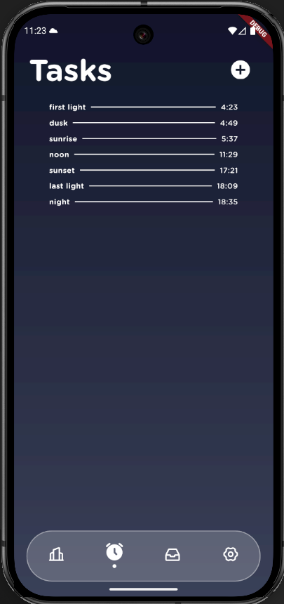

 
 
 

	<h3 align="center">➕ Add Fixed Task</h3>
	<em align="center">✨ Users can add tasks based on what time it occurs ✨</em>    
	

 
 
 

	<h3 align="center">📝 Details of Fixed Task</h3>
	<em align="center">Users can view and edit details of a fixed task.</em>    
	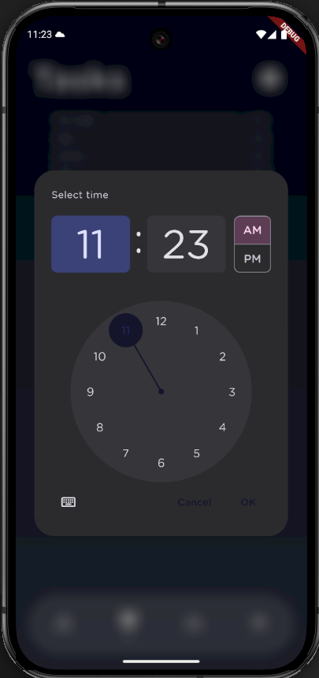

 
 
 

	<h3 align="center">✅ Results of Adding Fixed Task</h3>
	<em align="center">The fixed task is now added to the list.</em>    
	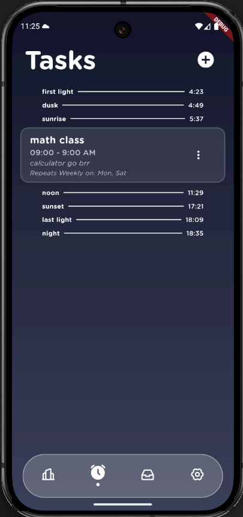

 
 
 

	<h3 align="center">➕ Add Relative Task</h3>
	<em align="center">✨ Users can add tasks based on how many minutes before/after sunrise or sunset! ✨</em>    
	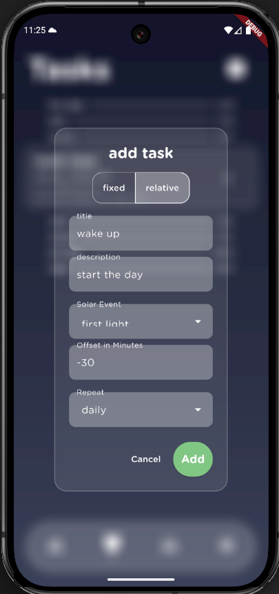

 
 
 

	<h3 align="center">✅ Results of Adding Relative Task</h3>
	<em align="center">✨ The task is now visible in the list ✨</em>    
	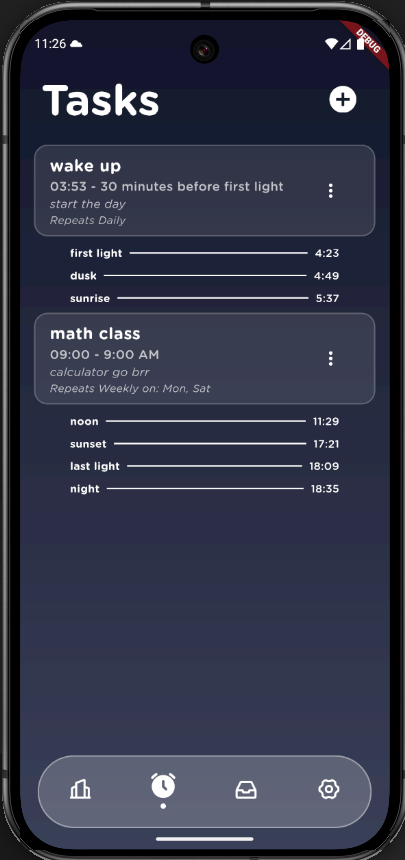

 
 
 

<!--  EVENT SECTION -->

	<h3 align="center">📅 Events List</h3>
	<em align="center"> Users can view all scheduled duration events </em>    
	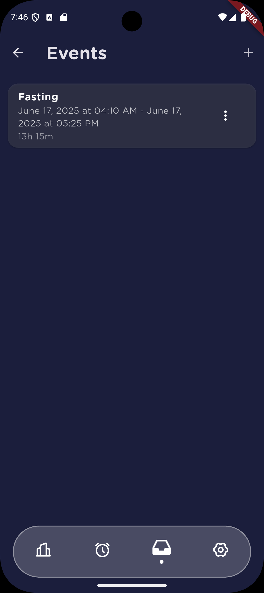

 
 
 

	<h3 align="center">➕ Add New Event</h3>
	<em align="center"> Users can create new event</em>    
	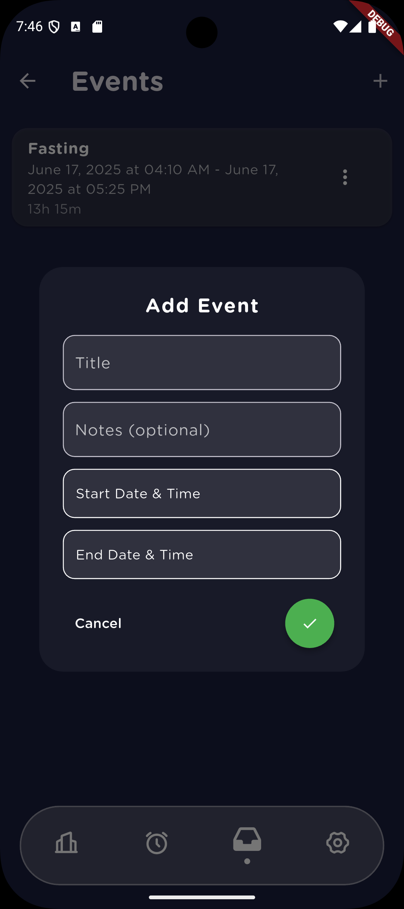

 
 
 

	<h3 align="center">📝 Edit Event</h3>
	<em align="center">Edit and update the details of the event</em>    
	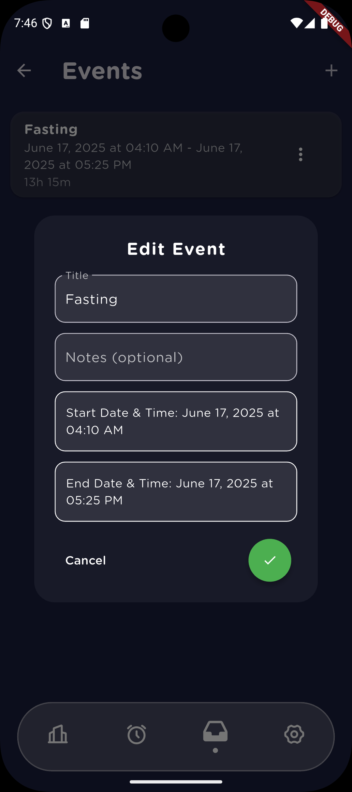

 
 
 

	<h3 align="center">🕘 Pick Event Duration</h3>
	<em align="center">Setting the start-end date and time of the event</em>    
	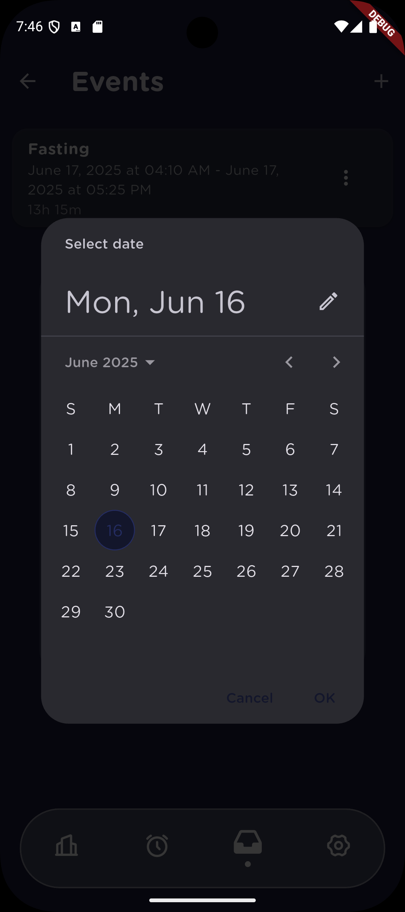    
	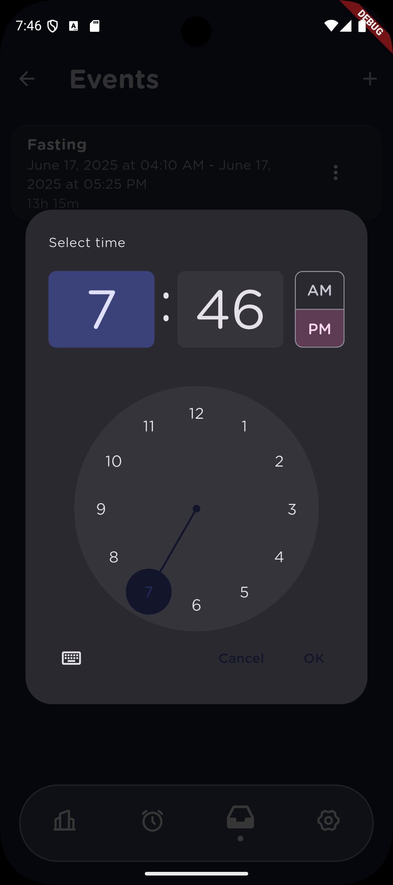

 
 
 

	<h3 align="center">🗑️ Delete Event</h3>
	<em align="center">Remove an event via the menu on the event card</em>    
	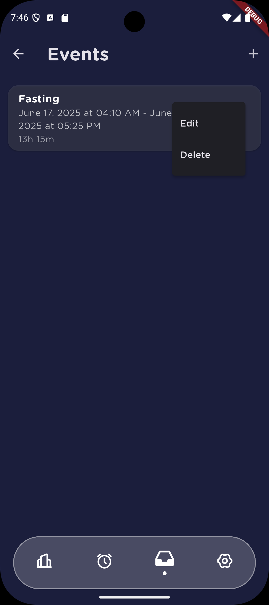

 
 
 

<!--  AUTH SECTION -->

	<h3 align="center">🔑 Login Screen</h3>
	<em align="center">Users can log in to their accounts.</em>    
	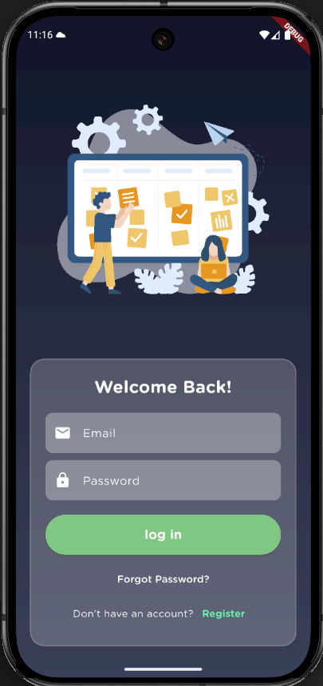

 
 
 

	<h3 align="center">📝 Signup Screen</h3>
	<em align="center">New users can create an account.</em>    
	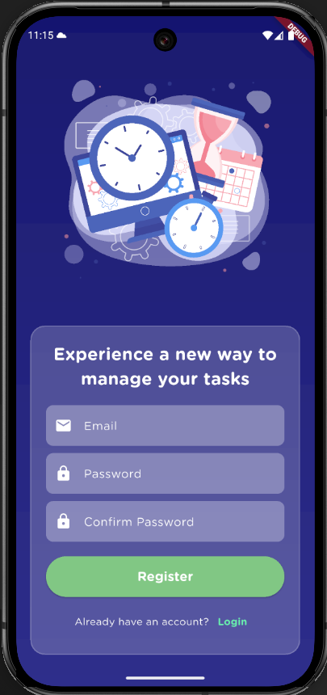

