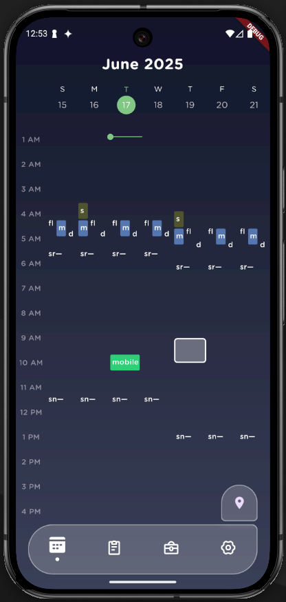
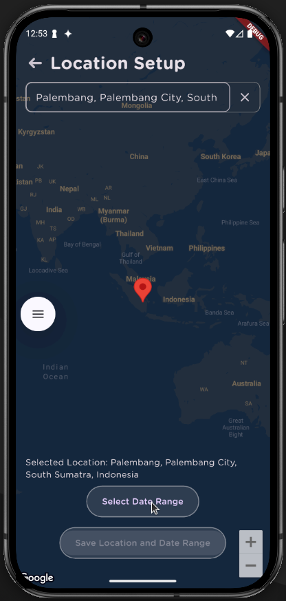
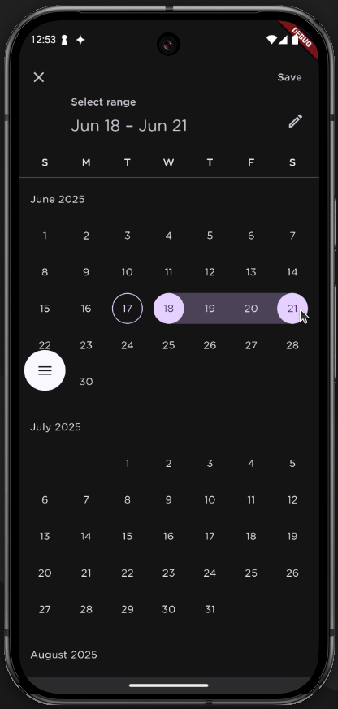
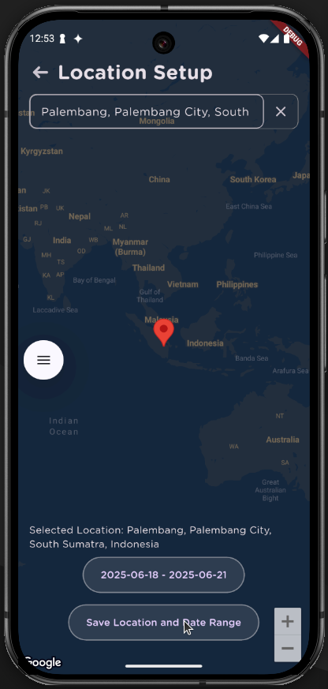
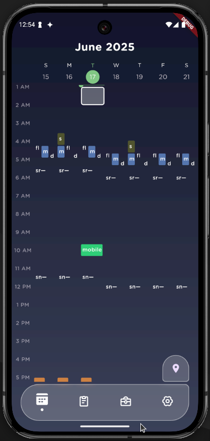
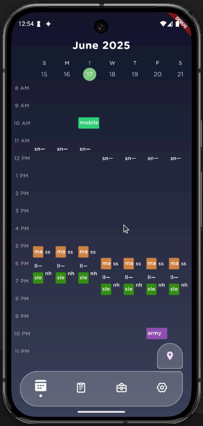

 

> ⚠️ ⚠️ **Notice for ITS Mobile Programming Graders** 
> please make sure that you are referring to ***one of the branches below*** and their respective commits for grading, as the ***main branch includes latest commits*** to the app, ***including updates done after assignment deadline/s.***

- **Section 5, 25 Mar 2025:** `s05`
- **Section 11, 19 May 2025:** `s11`

 

## Group 2
| **Name** | **NRP** | **Class** | **Contribution** |
| --- | --- | --- | --- | 
| **Areta Athayayumna Arwaa** | 5025221068 | Mobile Programming (I) | Events CRUD & Solar Times API Setup |
| **Franshel Tranetha** | 5025221083 | Mobile Programming (I) | Firebase Auth Setup & Account Detail CRUD |
| **Taib Izzat Samawi** | 5025221085 | Mobile Programming (I) | Dynamic Calendar, GMaps Integration, Tasks CRUD |

 

# `sundial` *(work in progress 🛠️)*
> *an intercogni app*

Manage your daily chores based on solar events.

## 🌟 Feature Development Status 🚧
> ***sundial** will undergo gradual improvements in features. below are the checklist of proposed features of **sundial***

### 🌟 Main Pipeline 🚀
- [x] Firebase Auth
- [x] Firestore Cloud Peristence
- [x] CRUD on tasks based on solar event times
- [x] API call for solar events based on current latitude and longitude
- [x] CRUD on events
- [x] Dynamic Calendar
- [x] GMaps Location API for setting up locations in each date

### APIs to use
- [x] SunriseSunsetTimes.org
- [x] Google Maps Reverse Geolocator
- [x] Google Maps Map Tiling
- [x] Google Maps Reverse Geolocator

## ✨ App Summary

### Demo Video
[Click here to watch the demo video!](https://github.com/intercogni/sundial/blob/s05/docs/demo_video.webm)

  

    <h3 align="center">🔑 Login Screen</h3>
    <em align="center">Users can log in to their accounts.</em>    
    
  

  

    <h3 align="center">📝 Signup Screen</h3>
    <em align="center">New users can create an account.</em>    
    
  

### A calendar is available on the home page, and the user can set locations they would be in during certain dates via GMaps, and the solar times will change accordingly

	<h3 align="center">📅 Calendar Before Change</h3>
	

 
 
 

	<h3 align="center">📍 Location Selection</h3>
	<em align="center">Users can select a location for the event.</em>    
	
	
	
	

 
 
 

	<h3 align="center">📅 Calendar After Change</h3>
	
	

 
 
 

<!--  TASK SECTION -->

	<h3 align="center">🏠 Tasks Screen</h3>
	<em align="center">✨ This is the main screen displaying all tasks ✨</em>    
	

 
 
 

  

    <h3 align="center">➕ Add Fixed Task</h3>
    <em align="center">✨ Users can add tasks based on what time it occurs ✨</em>    
    
  

  

    <h3 align="center">📝 Details of Fixed Task</h3>
    <em align="center">Users can view and edit details of a fixed task.</em>    
    
  

  

    <h3 align="center">✅ Results of Adding Fixed Task</h3>
    <em align="center">The fixed task is now added to the list.</em>    
    
  

 
 
 

  

    <h3 align="center">➕ Add Relative Task</h3>
    <em align="center">✨ Users can add tasks based on how many minutes before/after sunrise or sunset! ✨</em>    
    
  

  

    <h3 align="center">✅ Results of Adding Relative Task</h3>
    <em align="center">✨ The task is now visible in the list ✨</em>    
    
  

 
 
 

<!--  EVENT SECTION -->

	<h3 align="center">📅 Events List</h3>
	<em align="center"> Users can view all scheduled duration events </em>    
	

 
 
 

	<h3 align="center">➕ Add New Event</h3>
	<em align="center"> Users can create new event</em>    
	

 
 
 

	<h3 align="center">📝 Edit Event</h3>
	<em align="center">Edit and update the details of the event</em>    
	

 
 
 

	<h3 align="center">🕘 Pick Event Duration</h3>
	<em align="center">Setting the start-end date and time of the event</em>    
	    
	

 
 
 

	<h3 align="center">🗑️ Delete Event</h3>
	<em align="center">Remove an event via the menu on the event card</em>    
	

 
 
 

<!--  AUTH SECTION -->
